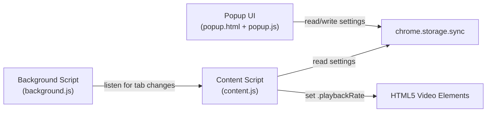

# Video Speed Controller - Pro — Chrome Extension

A Chrome extension that gives you full control over HTML5 video playback speed on any website. Set a global default speed or configure site-specific overrides — changes apply instantly, no page reload required.

**Version:** 0.0.1
**Author:** [Sajjad Ahmed Niloy](https://sajjadahmed.com)

---

## Features

- **Control any video, anywhere** — Adjust playback speed from 0.25x to 4.00x on any website. Speed through lectures, slow down tutorials, or binge-watch at your own pace.
- **Different speeds for different sites** — Watch Udemy tutorials at 2x but enjoy Netflix at normal speed. Set up to 10 site-specific rules that kick in automatically.
- **One-click current site** — Already on the page? Click "Use Current Site" to add the domain instantly — no typing needed.
- **Instant, no-refresh updates** — Change a speed and it applies to the video right away. Works seamlessly on single-page apps like YouTube, Facebook, and Twitter.
- **Pin it, forget it** — Pin the extension to your toolbar. One click to open, adjust, and you're done.
- **Modern dark UI** — A sleek, polished interface with smooth animations, custom-styled controls, and a card-based layout. No browser-default ugliness — just a clean, intuitive experience.

---

## Download

| Format | Link |
|--------|------|
| ZIP | [video-speed-controller-pro-v0.0.1.zip](download/video-speed-controller-pro-v0.0.1.zip) |
| CRX | [video-speed-controller-pro-v0.0.1.crx](download/video-speed-controller-pro-v0.0.1.crx) |

---

## Installation

### Option 1: Install from ZIP (recommended)

1. Download the [ZIP file](download/video-speed-controller-pro-v0.0.1.zip) from the download section above.
2. Extract the ZIP to a folder on your computer.
3. Open Chrome and navigate to `chrome://extensions`.
4. Enable **Developer mode** (toggle in the top-right corner).
5. Click **Load unpacked** and select the extracted folder.
6. Click the **puzzle piece icon** in the Chrome toolbar and pin **Video Speed Controller - Pro**.

### Option 2: Install from CRX

1. Download the [CRX file](download/video-speed-controller-pro-v0.0.1.crx) from the download section above.
2. Open Chrome and navigate to `chrome://extensions`.
3. Enable **Developer mode** (toggle in the top-right corner).
4. Drag and drop the `.crx` file onto the extensions page.
5. Click **Add extension** when prompted.

### Option 3: Install from source

1. Clone this repository:
   ```bash
   git clone https://github.com/sajjad-ahmed/video-speed-control-chrome.git
   ```
2. Open Chrome and navigate to `chrome://extensions`.
3. Enable **Developer mode** (toggle in the top-right corner).
4. Click **Load unpacked** and select the cloned folder.
5. Click the **puzzle piece icon** in the Chrome toolbar and pin **Video Speed Controller - Pro**.

---

## Usage

1. Click the extension icon in the toolbar to open the popup.
2. **Global Speed** — Select a speed from the dropdown. This applies to all websites by default.
3. **Site-Specific Speed** — Click **Add Site** or **Use Current Site** to add a domain.
   - Enter a domain name (e.g. `youtube.com`).
   - Choose a speed from the dropdown.
   - Click the **checkmark** button to apply and save.
   - Click the **X** button to remove an entry.
4. Site-specific speeds always override the global speed for matching domains.

---

## How It Works

```
┌──────────────┐     ┌──────────────────────┐     ┌────────────────┐
│  Popup UI    │────>│  chrome.storage.sync  │<────│ Content Script │
│  (popup.js)  │     │                      │     │  (content.js)  │
└──────────────┘     └──────────────────────┘     └───────┬────────┘
                                                          │
                                                          v
                                                   ┌──────────────┐
                                                   │ <video>      │
                                                   │ .playbackRate│
                                                   └──────────────┘
```

- **Popup** reads and writes settings (global speed + site overrides) to `chrome.storage.sync`.
- **Content script** runs on every page, reads the stored settings, and applies the correct `playbackRate` to all `<video>` elements.
- A **MutationObserver** watches for dynamically added videos (common in SPAs).
- The content script listens to `chrome.storage.onChanged` so speed changes apply in real time.
- The **background service worker** sends a message to the content script on tab navigation for SPA compatibility.

---

## Precedence Logic

```
if (site-specific override exists for the current domain)
    use the site-specific speed
else
    use the global speed
```

Domain matching supports subdomains — a rule for `youtube.com` also matches `www.youtube.com` and `m.youtube.com`.

---

## File Structure

```
video-speed-control/
├── icons/
│   ├── icon01.png         # Original icon (source)
│   ├── icon02.png         # Alternate icon (source)
│   ├── icon16.png         # Icon 16x16 (toolbar)
│   ├── icon48.png         # Icon 48x48 (extensions page)
│   └── icon128.png        # Icon 128x128 (Chrome Web Store)
├── manifest.json          # Chrome extension manifest (Manifest V3)
├── popup.html             # Popup UI structure
├── popup.css              # Popup styling (dark theme, modern components)
├── popup.js               # Popup logic (settings management, UI interactions)
├── content.js             # Content script (applies playbackRate to videos)
├── background.js          # Service worker (tab navigation handling)
├── download/
│   ├── video-speed-controller-pro-v0.0.1.zip   # Installable ZIP package
│   └── video-speed-controller-pro-v0.0.1.crx   # Signed CRX package
├── .gitignore             # Git ignore rules
├── LICENSE                # MIT License
└── README.md              # This file
```

---
## Architecture

The extension consists of 4 main parts:


---

## Storage Schema

Settings are synced via `chrome.storage.sync`:

```json
{
  "globalSpeed": 1.0,
  "siteOverrides": [
    { "domain": "youtube.com", "speed": 2.0 },
    { "domain": "facebook.com", "speed": 1.5 }
  ]
}
```

- `globalSpeed` — Float between 0.25 and 4.00 (default: 1.00)
- `siteOverrides` — Array of up to 10 domain/speed entries


---

## License

This project is licensed under the [MIT License](LICENSE).

---

## Developer

**Sajjad Ahmed Niloy**
Website: [sajjadahmed.com](https://sajjadahmed.com)
